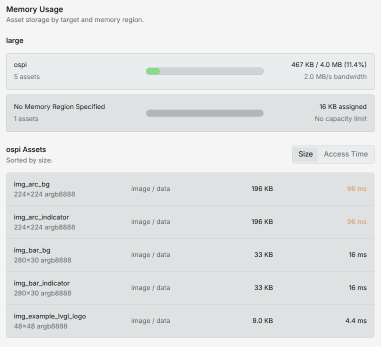

<Callout type="info">
This feature requires [LVGL Pro Editor v2.0](https://github.com/lvgl/lvgl_editor/releases) or higher.
</Callout>

If multiple `<target>`s are declared in [`project.xml`](./project), the Editor will allow you to conditionally
include/exclude assets, styles, and even views based on the selected target. 

## Example configuration

We will use the following `project.xml` as an example:
```xml
<project name="my_ui" lvgl_version="9.5.0">
    <targets>
        <target name="large">
            <display width="800" height="480"/>
            <memory name="int_flash" size="1MB"/>
            <memory name="ospi" size="16MB" bandwidth="4MB/s"/>
        </target>
        <target name="small">
            <display width="480" height="320"/>
            <memory name="int_flash" size="512kB"/>
        </target>
    </targets>
</project>
```

## `if_target`

Several XML elements support an `if_target` property where one or more targets can be added to 
enable the content of that block. 
For example:

```xml
<globals>
    <!-- Images for the `large` target -->
    <images if_target="large">
        <data name="logo.png" src_path="images/logo_large.png" />
        <data name="sunny.png" src_path="images/sunny_large.png" />
    </images>

    <!-- Images for all the other cases -->
    <images>
        <data name="logo.png" src_path="images/logo_normal.png" />
        <data name="sunny.png" src_path="images/sunny_normal.png" />
    </images>
</globals>
```

The same works for 
- `<fonts>`
- `<styles>`
- `<consts>`
- and most importantly `<view>`

Multiple targets can be specified as `if_target="large|medium"`. 
The block will be included if the current target is either `large` or `medium`.


## Memory Usage

When a target is set for an `<images>` or `<fonts>` block a `memory` attribute can be added to specify the memory 
region to be used from the given target. 

If the memory region is set and `globals.xml` is opened, the editor will show an overview of the memory usage 
for the selected target. It also shows the access time estimation based on the set `bandwidth` for the given memory region.



## Precedence

Always the first match has priority, so if a `<view>` has an `if_target` 
that matches the current target, all the other `<view>`s will be ignored. 
This allows you to have a default `<view>` as the last block, and then override it for specific targets before that.

## Selecting a target

When C code is exported all the blocks with `if_target` are wrapped to `if` and `#if`. That
is, it's possible to select the target at runtime or at compile time. 

### Runtime selection

It's useful when you need to support multiple targets with the same binary. For example, if you have a product that comes in two different screen sizes, you can use the same firmware for both, and select the target at runtime based on the detected hardware.

Its disadvantage is that all the assets and styles for all targets will be included in the binary, which increases the size of the firmware.

Also, the firmware needs to support all the features of all targets, which can be a problem if the targets have very different capabilities. For example if a widget uses OpenGL and 3D, it can't run on an MCU. In this case compile time selection is the only option.

To select the target at runtime, you can call `<project_name>_set_target(<PROJECT_NAME>_<TARGET_NAME>)`. For example:
```c
my_ui_set_target(MY_UI_LARGE);
```

### Compile time selection

To save memory and binary size, you can select the target at compile time. This way only the assets and styles for the selected target will be included in the binary.

Just set a `<PROJECT_NAME>_TARGET` `define` to `<PROJECT_NAME>_<TARGET_NAME>`. For example:
```c
#define MY_UI_TARGET MY_UI_LARGE
```
In CMake you can add a definition like this:
```cmake
add_definitions(-DMY_UI_TARGET=MY_UI_LARGE)
```
